# 01 — Individual Problem Scan

> Học viên: Đinh Hoài Nam  
> Mã học viên: 2A202601889  

---

## 1. Scan rộng (10 Problems)

| # | Lăng kính | Problem quan sát được | Ai chịu ảnh hưởng? (Actor) | Dấu hiệu thật |
|---|---|---|---|---|
| 1 | **Lặp lại** | Phải nhập tay dữ liệu hóa đơn/chứng từ từ file PDF/ảnh scan vào phần mềm kế toán | Kế toán (Accountant) | Mất 2-3 tiếng/ngày nhập liệu; hay sai sót số liệu khi khối lượng hóa đơn cuối tháng tăng cao. |
| 2 | **Lặp lại** | Gửi email chăm sóc & nhắc lịch hẹn lặp đi lặp lại cho từng khách hàng tiềm năng | Nhân viên Sales (Sales Exec) | Mất 90 phút/ngày copy-paste template email; thỉnh thoảng quên follow-up khách hàng cũ. |
| 3 | **Tốn thời gian** | Sàng lọc và tóm tắt 50-100 CV ứng viên cho một vị trí tuyển dụng để chọn ra danh sách phỏng vấn | Nhân viên Tuyển dụng (HR Recruiter) | Mất 4-5 tiếng/đợt tuyển dụng; xem thủ công từng CV dễ bỏ sót ứng viên phù hợp hoặc đánh giá cảm tính. |
| 4 | **Tốn thời gian** | Đọc các tài liệu nghiệp vụ/quy trình dài 30-50 trang để viết tài liệu Yêu cầu phần mềm (SRS / User Story) | Business Analyst (BA) | Mất 1-2 ngày/dự án để đọc hiểu và tổng hợp; dễ bỏ sót các trường hợp biên (edge cases). |
| 5 | **AI có thể tốt hơn** | Tổng hợp số liệu doanh thu, chi phí và chỉ số từ rải rác 4-5 dashboard/Excel để làm báo cáo tuần cho HĐQT | CEO / Founder / Manager | Mất 2-3 tiếng tối CN để tổng hợp; báo cáo bị trễ khiến cuộc họp định hướng đầu tuần thiếu số liệu cập nhật. |
| 6 | **AI có thể tốt hơn** | Phát hiện và phân loại lỗi schema/dữ liệu bất thường (data anomaly) từ các đường ống dữ liệu (data pipelines) | Data Engineer (DE) | Mất 1-2 tiếng/ngày viết script kiểm tra và debug khi pipeline bị gãy do nguồn dữ liệu đổi format. |
| 7 | **Pain từ người khác** | Khách hàng phàn nàn vì nhân viên CSKH trả lời chậm hoặc trả lời không thống nhất thông tin chính sách | Khách hàng & Team CSKH / Support | Khách hàng phải chờ 15-30 phút; nhân viên CSKH mất thời gian tra cứu lại wiki nội bộ. |
| 8 | **Pain từ người khác** | Nhân viên mới (Onboarding) liên tục hỏi Trưởng phòng/HR về quy định, chính sách công ty và quy trình làm việc | Nhân viên mới & HR / Team Lead | Trưởng phòng mất 30-40% thời gian tuần đầu chỉ để trả lời các câu hỏi quy trình lặp đi lặp lại. |
| 9 | **Lặp lại** | Viết nội dung mô tả sản phẩm (Product Description) và bài đăng quảng cáo trên 3-4 kênh mạng xã hội | Marketing Content Exec | Mất 3-4 tiếng/tuần vò đầu bứt tóc tìm ý tưởng bài viết và format lại cho từng nền tảng (Facebook, LinkedIn). |
| 10 | **Tốn thời gian** | Phân loại và tổng hợp các phản hồi/review của người dùng trên App Store/Google Play để tìm ra tính năng bị lỗi | Product Manager (PM) | Mất 3 tiếng/tuần đọc hàng trăm comment rải rác; khó thống kê được lỗi nào đang ảnh hưởng nhiều người nhất. |

---

## 2. Chọn Top 3

| Rank | Problem | Vì sao chọn | Điều còn chưa chắc |
|---|---|---|---|
| 1 | **Problem #3: Sàng lọc CV ứng viên (HR Recruiter)** | Workflow rõ ràng, khối lượng công việc lặp lại cực kỳ lớn, mất nhiều thời gian đọc hiểu textual data (CV), độ phù hợp với AI/LLM rất cao. | Khả năng AI đánh giá lệch (bias) hoặc bỏ sót CV trình bày dạng layout phức tạp/ảnh scan. |
| 2 | **Problem #1: Nhập liệu hóa đơn chứng từ (Kế toán)** | Pain point rất đau, tốn nhiều giờ lặp đi lặp lại mỗi ngày, rủi ro sai sót con người cao. | Độ chính xác OCR khi hóa đơn bị mờ, rách hoặc format dị biệt từ nhà cung cấp. |
| 3 | **Problem #4: Đọc tài liệu nghiệp vụ viết SRS/User Story (BA)** | Mất nhiều thời gian tư duy và tổng hợp, tác động trực tiếp tới tiến độ toàn bộ dự án phần mềm. | AI có hiểu đúng ngữ cảnh bài toán kinh doanh đặc thù (domain knowledge) hay không. |

---

## 3. Top 3 Problem Cards & Draft Workflows

### 📌 Problem Card #1 — Sàng lọc CV ứng viên (HR Recruiter)

- **Problem 1 câu:** Nhân viên tuyển dụng phải mở rải rác hàng loạt trang tuyển dụng/ATS (TopCV, LinkedIn, ITViec, Vietnamworks...) và email để thu thập CV, sau đó mất 4-5 tiếng đọc thủ công 50-100 CV để chấm điểm đối chiếu với JD.
- **Actor:** HR Recruiter (Nhân viên tuyển dụng).
- **Thời điểm / bối cảnh:** Khi mở đợt tuyển dụng mới, nhận ứng viên từ nhiều kênh khác nhau cùng lúc.
- **Current Workflow:**
  1. Mở song song hàng loạt tab trình duyệt (TopCV, LinkedIn, ITViec, Vietnamworks, Email) để tải và kiểm tra CV.
  2. Tổng hợp dữ liệu ứng viên từ nhiều nguồn rải rác về một thư mục/bảng theo dõi chung.
  3. Mở từng file CV (PDF/Word) đọc kỹ năng, kinh nghiệm, học vấn.
  4. So sánh thủ công các tiêu chí trong CV với Job Description (JD).
  5. Lập bảng Excel đánh giá, chấm điểm và ghi chú từng ứng viên.
  6. Chọn ra Top 10-15 ứng viên gửi cho Trưởng phòng chuyên môn review và gửi email hẹn phỏng vấn.
- **Bottleneck:** Bước 1, 2, 3 & 4 — Phải mở liên tục hàng chục tab trên các nền tảng ATS khác nhau (TopCV, LinkedIn, ITViec...), thu thập dữ liệu phân tán, đọc từng CV và tự nhập bảng chấm điểm Excel mất 4-5 tiếng/lô.
- **Impact:** Mất thời gian thao tác qua lại giữa nhiều trang web, dễ sót ứng viên ở các kênh phụ, làm trễ quy trình tuyển dụng 2-3 ngày, tăng nguy cơ ứng viên giỏi nhận lời mời làm việc nơi khác.
- **Success Metric kỳ vọng:** Giảm thời gian tổng hợp & sàng lọc sơ bộ từ 4-5 tiếng xuống dưới 45 phút/đợt tuyển dụng; tập trung dữ liệu đa nguồn về một nơi và không bỏ sót ứng viên >80% match JD.
- **Giải pháp No-AI thay thế:** Dùng phần mềm ATS trả phí đắt đỏ để tự động kéo dữ liệu (nhưng thường không hỗ trợ đầy đủ hoặc khó đồng bộ tất cả các trang tuyển dụng tại Việt Nam).
- **Giả định AI:** AI Workflow & Parser tự động gom dữ liệu từ nhiều nguồn (PDF, Email, các trang TopCV/LinkedIn), trích xuất thông tin, so sánh tiêu chí với JD và đề xuất điểm match % kèm lý do tóm tắt. HR giữ vai trò duyệt cuối (Human-in-the-loop).

#### 🔄 Draft Workflow (HR Recruiter)

```mermaid
graph TD
    subgraph CURRENT_STATE ["CURRENT STATE — 4-5 Tiếng (Thủ công)"]
        A1["1. Nhận 50-100 CV từ Email/Form"] --> A2["2. Mở từng file CV đọc từng dòng (200' - BOTTLENECK)"]
        A2 --> A3["3. Đánh giá & chấm điểm thủ công vào Excel (60')"]
        A3 --> A4["4. Lọc Top 10 gửi Trưởng phòng duyệt (30')"]
        A4 --> A5["5. Gửi email hẹn phỏng vấn"]
    end

    subgraph FUTURE_STATE ["FUTURE STATE — ~45 Phút (Tối ưu với AI Workflow)"]
        B1["1. Nhận 50-100 CV"] --> B2["2. AI Parser trích xuất & chấm % Match với JD (5')"]
        B2 --> B3["3. AI lập Bảng Dashboard xếp hạng & Tóm tắt ưu/nhược điểm (Tự động)"]
        B3 --> B4["4. HR Review & Xác nhận kết quả sàng lọc của AI (35' - Human-in-the-loop)"]
        B4 --> B5["5. Trigger email tự động gửi hẹn PV (5')"]
    end
```

---

### 📌 Problem Card #2 — Nhập liệu hóa đơn chứng từ (Kế toán)

- **Problem 1 câu:** Kế toán phải mất 2-3 tiếng mỗi ngày nhập thủ công từng thông số hóa đơn PDF/ảnh vào phần mềm, dễ gây sai sót số liệu tài chính khi khối lượng tăng cao.
- **Actor:** Kế toán viên (Accountant).
- **Thời điểm / bối cảnh:** Hằng ngày khi nhận hóa đơn mua hàng/dịch vụ từ các nhà cung cấp gửi về.
- **Current Workflow:**
  1. Thu thập hóa đơn từ Email/Zalo (PDF, PNG, JPG).
  2. Mở từng hóa đơn, đọc tên công ty, MST, ngày tháng, mã hàng, tiền trước thuế, VAT, tổng tiền.
  3. Mở phần mềm Kế toán (MISA/Bravo/Excel).
  4. Gõ tay từng dòng dữ liệu vào hệ thống.
  5. Đối chiếu tổng tiền giữa phần mềm và hóa đơn gốc.
  6. Lưu chứng từ và lưu file vào thư mục.
- **Bottleneck:** Bước 2 & 4 — Đọc và gõ tay lại dữ liệu từ hóa đơn vào phần mềm kế toán (mất 2-3 phút/hóa đơn, lặp lại hàng chục lần/ngày).
- **Impact:** Mất 2-3 tiếng/ngày (chiếm 30-40% thời gian làm việc), nguy cơ nhập sai mã số thuế hoặc tiền hàng dẫn đến lệch sổ sách kế toán.
- **Success Metric kỳ vọng:** Giảm thời gian xử lý hóa đơn xuống còn 30 giây/hóa đơn (giảm 80% thời gian); độ chính xác trích xuất dữ liệu >95%.
- **Giải pháp No-AI thay thế:** Yêu cầu nhà cung cấp gửi file Excel xuất từ phần mềm của họ, nhưng hầu hết nhà cung cấp chỉ gửi file PDF/hóa đơn điện tử tĩnh.
- **Giả định AI:** AI Vision / Intelligent OCR tự động đọc hiểu hình ảnh/PDF hóa đơn, bóc tách cấu trúc JSON và tự động map vào các trường dữ liệu trên hệ thống.

#### 🔄 Draft Workflow (Kế toán)

```mermaid
graph TD
    subgraph CURRENT_STATE ["CURRENT STATE — 2-3 Tiếng/Ngày"]
        A1["1. Nhận file hóa đơn PDF/Ảnh"] --> A2["2. Mở file nhìn từng dòng số liệu (BOTTLENECK)"]
        A2 --> A3["3. Gõ tay số liệu vào phần mềm kế toán (BOTTLENECK)"]
        A3 --> A4["4. So sánh tổng tiền thủ công"]
        A4 --> A5["5. Lưu chứng từ"]
    end

    subgraph FUTURE_STATE ["FUTURE STATE — ~20 Phút/Ngày (Tối ưu với AI OCR)"]
        B1["1. Upload lô file hóa đơn"] --> B2["2. AI Vision OCR đọc & trích xuất JSON tự động (2')"]
        B2 --> B3["3. Hệ thống tự map vào phần mềm Kế toán (Tự động)"]
        B3 --> B4["4. Kế toán đối soát các trường bị cảnh báo đỏ (15' - Human Verification)"]
        B4 --> B5["5. Chốt lưu chứng từ"]
    end
```

---

### 📌 Problem Card #3 — Phân tích tài liệu viết SRS / User Story (Business Analyst)

- **Problem 1 câu:** BA mất 1-2 ngày cho mỗi dự án để đọc các tài liệu quy trình nghiệp vụ dài 30-50 trang để trích xuất danh sách yêu cầu phần mềm và User Story, dễ bỏ sót các trường hợp ngoại lệ (Edge Cases).
- **Actor:** Business Analyst (BA).
- **Thời điểm / bối cảnh:** Giai đoạn khởi chạy dự án phần mềm mới hoặc nhận yêu cầu thay đổi từ khách hàng/sếp.
- **Current Workflow:**
  1. Nhận tài liệu nghiệp vụ (BRD/Quy trình kinh doanh) từ khách hàng.
  2. Đọc lướt và đọc chi tiết 30-50 trang tài liệu.
  3. Ghi chú các luồng nghiệp vụ và quy tắc kinh doanh (Business Rules).
  4. Viết danh sách Functional Requirements và User Stories trên Jira/Confluence.
  5. Tự suy nghĩ và phát hiện các trường hợp ngoại lệ (Edge cases / Exception flows).
  6. Họp với Dev/QA để giải thích và chỉnh sửa Yêu cầu.
- **Bottleneck:** Bước 2, 4 & 5 — Đọc tóm tắt tài liệu cồng kềnh, chuyển hóa thành dạng User Story chuẩn và tư duy liệt kê hết các trường hợp ngoại lệ.
- **Impact:** Tốn 1-2 ngày làm việc; nếu bỏ sót edge case ở bước này sẽ dẫn đến Dev làm sai, sửa lại ở giai đoạn sau tốn chi phí gấp 10 lần.
- **Success Metric kỳ vọng:** Rút ngắn thời gian viết bản nháp SRS/User Story từ 2 ngày xuống 3 tiếng; phát hiện thêm 30% các trường hợp biên (edge cases) ngay từ đầu.
- **Giải pháp No-AI thay thế:** Dùng Checklist/Template SRS có sẵn, nhưng vẫn phải tự đọc hiểu toàn bộ tài liệu gốc bằng tay.
- **Giả định AI:** AI (RAG / Document Analyzer) đọc hiểu toàn bộ tài liệu BRD, phân tích luồng, gợi ý bộ User Story nháp theo format chuẩn và liệt kê sẵn danh sách 10+ Edge Cases nguy cơ để BA review.

#### 🔄 Draft Workflow (Business Analyst)

```mermaid
graph TD
    subgraph CURRENT_STATE ["CURRENT STATE — 1-2 Ngày/Dự án"]
        A1["1. Nhận tài liệu BRD 30-50 trang"] --> A2["2. Đọc thủ công & highlight ý chính (6-8 tiếng - BOTTLENECK)"]
        A2 --> A3["3. Soạn thảo User Stories từ đầu (4 tiếng)"]
        A3 --> A4["4. Tự vò đầu bứt tóc suy nghĩ Edge Cases (2 tiếng - BOTTLENECK)"]
        A4 --> A5["5. Họp review với Dev/QA"]
    end

    subgraph FUTURE_STATE ["FUTURE STATE — ~3 Tiếng/Dự án (Tối ưu với AI Assistant)"]
        B1["1. Nhập BRD vào AI Assistant"] --> B2["2. AI phân tích luồng & sinh bản nháp User Stories + Edge Cases (10')"]
        B2 --> B3["3. BA review, chỉnh sửa & bổ sung context đặc thù (2 tiếng - Human Expertise)"]
        B3 --> B4["4. AI format lại đúng tiêu chuẩn Jira/Confluence (5')"]
        B4 --> B5["5. Export & Họp review với Dev/QA"]
    end
```

