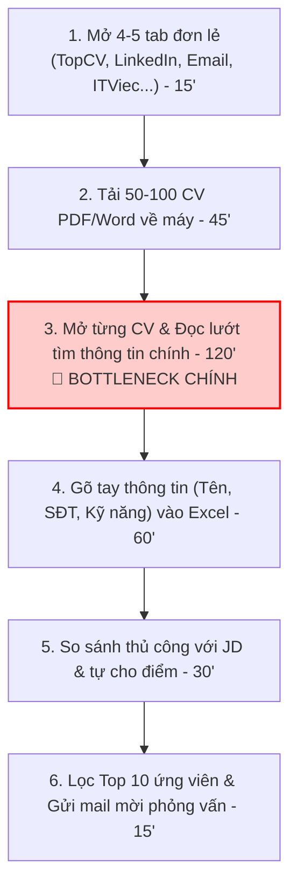
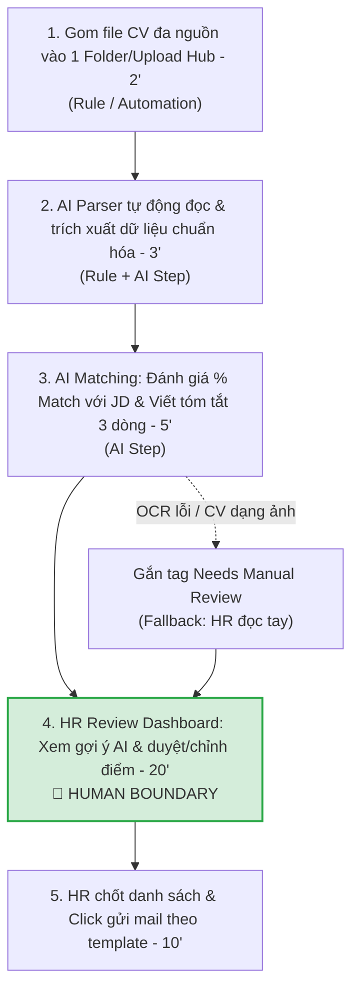

# 02 — Group Problem Statement: Gom & Sàng Lọc CV Ứng Viên Đa Nguồn Cho HR Recruiter

## Thành viên nhóm

| STT | Họ và tên | Mã học viên | Vai trò trong nhóm | Tên Zalo |
|-----|-----------|-------------|--------------------|----------|
| 1 | Trần Xuân Bách | 2A202601093 | Nhóm trưởng | Trần Xuân Bách |
| 2 | Nguyễn Duy Trọng | 2A202601333 | Thành viên | Nguyễn Duy Trọng |
| 3 | Đinh Hoài Nam | 2A202601889 | Thành viên | Đinh Hoài Nam |
| 4 | Nguyễn Hoàng Tín | 2A202601603 | Thành viên | Nguyễn Hoàng Tín |
| 5 | Trịnh Quốc Trọng | 2A202601779 | Thành viên | Trịnh Quốc Trọng |
| 6 | Hà Ngọc Minh | 2A202602028 | Thành viên | Hà Ngọc Minh |
| 7 | Bùi Thế Huy | 2A202601881 | Thành viên | Bùi Thế Huy |
| 8 | Phạm Thị Thuỳ Linh | 2A202601181 | Thành viên | Phạm Linh |

---

# Phase 3 — Group Convergence (Hội tụ nhóm)

## 3.1 Trình bày các Candidate Problems
Nhóm 8 thành viên đã đề xuất và thảo luận **7 ứng viên bài toán (Candidate Problems)** từ phần scan cá nhân:

1. **Candidate 1: HR Recruiter — Gom & Sàng lọc CV đa nguồn (Chủ đề được chọn)** *(Đề xuất bởi Đinh Hoài Nam, Hà Ngọc Minh & Nhóm)*
   - *Problem*: HR Recruiter mất 4-5 tiếng mở hàng chục tab rải rác trên các nền tảng (TopCV, LinkedIn, ITViec, Vietnamworks, Email...) để đọc 50-100 CV/đợt, trích xuất kỹ năng và gõ lại bảng Excel đối chiếu.
   - *Bottleneck*: Đọc từng trang CV, trích xuất kỹ năng/kinh nghiệm và gõ tay bảng xếp hạng Excel (tốn 3-5 phút/CV).
   - *Impact & Metric*: Giảm tổng thời gian sàng lọc sơ bộ từ 4-5 tiếng (240-300 phút) xuống **< 45 phút/lô**; giảm trễ hạn quy trình tuyển dụng 2-3 ngày.
   - *AI Solution*: AI tự động trích xuất thông tin CV, chấm % Match với JD và đề xuất tóm tắt; HR duyệt kết quả cuối cùng.

2. **Candidate 2: Tổng hợp báo cáo tiến độ tuần (Weekly Status Report)** *(Đề xuất bởi Trần Xuân Bách - Nhóm trưởng)*
   - *Problem*: Junior PM / Team Leader / Scrum Master mất 90 phút mỗi thứ Hai trước giờ họp Sync để gom số liệu từ Jira/Trello, Google Sheets, Discord/Slack và viết báo cáo tiến độ kèm đánh giá rủi ro cho cấp trên.
   - *Bottleneck*: Biến dữ liệu thô (raw data) thành đoạn văn nhận xét, phân tích insight & đánh giá rủi ro (narrative mất 30 phút).
   - *Impact & Metric*: Giảm thời gian chuẩn bị báo cáo từ **90 phút → dưới 25 phút/tuần**.
   - *Non-AI Alternative*: Template cố định + Jira Dashboard (chỉ hiển thị được biểu đồ số liệu thô, không tự viết được nhận xét phân tích rủi ro).

3. **Candidate 3: Kiểm tra Rubric bài nộp Lab tự động** *(Đề xuất bởi Nguyễn Duy Trọng)*
   - *Problem*: Học viên trước khi nộp bài phải đọc và đối chiếu thủ công README, worksheet, bài mẫu và 3 file đầu ra để kiểm tra bài đã đáp ứng đầy đủ rubric hay chưa, tốn thời gian và dễ bỏ sót phần bắt buộc.
   - *Bottleneck*: Chuyển các yêu cầu rải rác thành checklist, sau đó đối chiếu từng yêu cầu với đúng file và nội dung bài làm.
   - *Impact & Metric*: Giảm thời gian kiểm tra từ **55 phút → dưới 20 phút**; phát hiện ít nhất 95% nội dung bị thiếu; tỷ lệ cảnh báo sai không quá 10%.
   - *Giải pháp*: Rule kiểm tra cấu trúc (file, heading, bảng) + AI kiểm tra ngữ nghĩa (metric, boundary, evidence). Học viên tự xem cảnh báo & sửa.

4. **Candidate 4: Tìm lỗi sấp mặt (Trace Bug) trên Microservices** *(Đề xuất bởi Trịnh Quốc Trọng)*
   - *Problem*: Developer tốn từ 1-3 tiếng đồng hồ lặn ngụp tìm kiếm `trace_id` qua nhiều service khác nhau trên Datadog/Log server mỗi khi QA quăng ticket báo lỗi mập mờ kiểu *"ấn nút thanh toán không được"*.
   - *Bottleneck*: Lần vết log qua nhiều microservice khi ticket báo lỗi thiếu thông tin context/trace_id.
   - *Impact & Metric*: Giảm thời gian tìm lỗi & truy vết từ **1-3 giờ → dưới 20 phút/lỗi**.

5. **Candidate 5: Tìm kiếm thông tin cũ rải rác trên Email, Discord, Slack** *(Đề xuất bởi Nguyễn Hoàng Tín)*
   - *Problem*: Người dùng mất nhiều thời gian tìm lại thông tin trong Email, Discord hoặc Slack khi cần xem lại tài liệu, quyết định hoặc hướng dẫn cũ.
   - *Bottleneck*: Thông tin phân tán trên nhiều nền tảng, phải tìm kiếm thủ công bằng từ khóa và đọc nhiều cuộc trò chuyện mới tìm được nội dung cần.
   - *Impact & Metric*: Giảm thời gian tìm kiếm từ **15-30 phút/lần → dưới 3 phút/lần**.

6. **Candidate 6: Điều tra & Troubleshooting KPI Power BI bị sai / null** *(Đề xuất bởi Phạm Thị Thuỳ Linh)*
   - *Problem*: Khi một KPI trên Power BI trả về null hoặc không khớp với số liệu mong đợi, Data Analyst và người dùng business tốn từ 1-3 giờ để lần lượt kiểm tra dữ liệu nguồn, DAX measure, filter context và relationship trước khi tìm được nguyên nhân.
   - *Bottleneck*: Data Analyst phải tự xác định thứ tự kiểm tra DAX, model hay dữ liệu nguồn trước; quá trình này dựa vào kinh nghiệm cá nhân và chuyển đổi liên tục giữa Power BI, SQL Editor và Fabric.
   - *Impact & Metric*: Giảm thời gian điều tra trung bình từ **1-3 giờ xuống dưới 30 phút/lỗi**; giảm số lần phải hỏi lại thông tin từ business.
   - *Điểm mạnh & Chưa chắc*: Workflow rõ, xảy ra thực tế và đo được thời gian; tuy nhiên cần giới hạn phạm vi vì mỗi lỗi KPI có nguyên nhân khác nhau.

7. **Candidate 7: Tra cứu thông báo & giải đáp cũ trên Discord server** *(Đề xuất bởi Bùi Thế Huy)*
   - *Problem*: Học viên mất 15-20 phút lội chat trên Discord để tìm lại các thông báo hoặc giải đáp cũ của Giảng viên/TA về quy định làm lab. Server đông người tin nhắn trôi rất nhanh, chatbot mặc định không nắm được câu trả lời mod/TA đã giải đáp.
   - *Bottleneck*: Lội chat thủ công trên server Discord nhiều thành viên khi tin nhắn và thông báo cũ trôi quá nhanh.
   - *Impact & Metric*: Giảm thời gian tìm câu trả lời từ **15-20 phút → dưới 2 phút/lần**.

## 3.2 Clustering & Shortlist
Nhóm phân loại 7 bài toán thành các nhóm chủ đề chính:
- **Nhóm Gom & Sàng lọc dữ liệu đa nguồn**: HR CV Screening *(Candidate 1 - ĐƯỢC CHỌN)*
- **Nhóm Tổng hợp Báo cáo & Viết Narrative**: Weekly Status Report *(Candidate 2)*
- **Nhóm Kiểm tra Tuân thủ & Rubric**: Lab Rubric Checker *(Candidate 3)*
- **Nhóm Troubleshooting & Debugging**: Power BI KPI Investigation *(Candidate 6)* & Microservices Trace Bug *(Candidate 4)*
- **Nhóm Tra cứu Thông tin & Search Ngữ cảnh**: Email/Discord/Slack Search *(Candidate 5)* & Discord QA Search *(Candidate 7)*

## 3.3 Scoring Matrix (Chấm điểm hội tụ 7 Candidate Problems)

| Tiêu chí đánh giá (Thang 1-5) | HR CV Screening | Weekly Report | Rubric Checker | Power BI KPI (Linh) | Microservice Bug | Search Email/Slack | Discord QA Search |
|---|---:|---:|---:|---:|---:|---:|---:|
| 1. Actor & Bối cảnh rõ ràng | 5 | 5 | 4 | 5 | 5 | 4 | 4 |
| 2. Workflow hiện tại vẽ được chi tiết | 5 | 5 | 5 | 4 | 4 | 4 | 4 |
| 3. Bottleneck cụ thể, không mơ hồ | 5 | 5 | 4 | 4 | 4 | 4 | 4 |
| 4. Baseline metric & Impact đo lường được | 5 | 5 | 4 | 4 | 4 | 3 | 3 |
| 5. Đủ điều kiện thực hiện dạng Pilot trong Lab | 5 | 4 | 5 | 3 | 3 | 3 | 4 |
| 6. Phù hợp để so sánh Rule / Workflow / Agent | 5 | 5 | 4 | 4 | 4 | 4 | 4 |
| 7. Nhóm hiểu sâu về Domain/Nghiệp vụ | 5 | 4 | 5 | 3 | 3 | 4 | 4 |
| **Tổng điểm** | **35 / 35** | **33 / 35** | **31 / 35** | **27 / 35** | **27 / 35** | **26 / 35** | **27 / 35** |

## 3.4 Quyết định chọn bài toán nhóm
Nhóm đồng thuận chọn **Candidate 1: HR Recruiter — Gom & Sàng lọc CV đa nguồn**.

- **Lý do chọn**:
  - Workflow hiện tại cực kỳ rõ ràng và mang tính lặp lại cao với tần suất hàng tuần/hàng tháng.
  - Bottleneck quá trình đọc & chuẩn hóa dữ liệu CV đa nguồn tốn nhiều thời gian (4-5 tiếng/đợt), tác động trực tiếp tới tiến độ tuyển dụng (Time-to-Hire).
  - Thành phần dữ liệu (CV PDF/Doc/Text + JD) rất phù hợp để ứng dụng AI trích xuất (Extraction) và chấm điểm phù hợp (Matching).
- **Lý do không chọn các bài toán khác**:
  - *Weekly Status Report*: Điểm rất cao (33/35) nhưng vướng rào cản kết nối trực tiếp API Jira/Sheets thực tế trong thời lượng lab ngắn.
  - *Lab Rubric Checker*: Scope hẹp, chủ yếu dùng Rule-based (Regex/Check file exist), phần dùng AI không rõ nét.
  - *Microservice Bug Trace*: Phụ thuộc vào hệ thống Datadog/Log server doanh nghiệp, khó giả lập dữ liệu.
  - *Search Email/Slack/Discord*: Vướng rào cản phân quyền API (Data Access/Permission) rộng, rủi ro bảo mật thông tin cá nhân cao.

---

# Phase 4 — Validation + Research (Kiểm chứng & Nghiên cứu)

## 4.1 Quick Validation (Kiểm chứng thực tế)
Nhóm đã thực hiện phỏng vấn nhanh 3 HR Recruiter/Talent Acquisition và survey 8 bạn làm nhân sự/tuyển dụng về thực trạng sử dụng các kênh tuyển dụng hiện nay:

| Nguồn kiểm chứng | Số lượng | Tín hiệu xác nhận | Tín hiệu phản bác / Cảnh báo | Nhóm điều chỉnh scope |
|---|---:|---|---|---|
| Phỏng vấn HR Recruiter | 3 người | **100% (3/3 HR)** xác nhận các nền tảng tuyển dụng (TopCV, LinkedIn, ITViec, Vietnamworks, Email...) hoạt động hoàn toàn **đơn lẻ, không liên kết với nhau**. HR phải chuyển tab liên tục, tải CV thủ công và gõ lại thông tin vào Excel để so sánh, tốn 4-5 tiếng mỗi đợt. | 1 HR cảnh báo: AI chấm % Match có thể bị lệch nếu chỉ dùng Keyword Matching đơn thuần mà không hiểu ngữ cảnh ngành. | Thu hẹp scope: AI chỉ **trích xuất dữ liệu & gợi ý % Match sơ bộ + Tóm tắt điểm mạnh/yếu**, HR luôn là người kiểm duyệt cuối cùng. |
| Survey nhanh nhóm HR | 8 người | **87.5% (7/8 HR)** gặp khó khăn vì dữ liệu bị phân tán trên các sàn tuyển dụng độc lập và rất muốn có 1 hub trung tâm gom CV tự động. | 2 HR lo ngại vấn đề bảo mật dữ liệu cá nhân ứng viên (PDPA/GDPR) khi đưa CV qua tool bên thứ 3. | Bổ sung Boundary: Dữ liệu CV chỉ xử lý local/chế độ bảo mật nghiêm ngặt, không dùng để train model public. |

**Insight rút ra sau Validation**:
> Các sàn tuyển dụng hiện tại hoạt động **đơn lẻ và không có kết nối dữ liệu với nhau**, buộc HR phải đóng vai "trợ lý nhập liệu thủ công" chuyển tab qua lại. Pain point cốt lõi là **"biến dữ liệu CV phân tán đa nguồn thành 1 bảng chuẩn hóa có đánh giá sơ bộ theo JD"**.

## 4.2 Research các giải pháp hiện có trên thị trường

| Giải pháp / Tool | Link / Nguồn kiểm chứng | Cách giải quyết | Ưu điểm | Hạn chế / Rủi ro | Bài học cho nhóm |
|---|---|---|---|---|---|
| **Base Hiring (ATS)** | [base.vn/hiring](https://base.vn/hiring) | Quản lý pipeline tuyển dụng tập trung | Quy trình chuẩn, phân quyền doanh nghiệp tốt | Phải nhập thủ công hoặc ứng viên phải tự điền form dài | Cần tính năng tự trích xuất CV tự động thay vì bắt HR nhập liệu thủ công |
| **TopCV AI / Vietnamworks** | [topcv.vn](https://topcv.vn) | Gợi ý ứng viên phù hợp trên sàn | Có sẵn kho dữ liệu ứng viên lớn | Chỉ dùng được trong nội bộ sàn đó, không gom được CV từ Email/LinkedIn/ITViec | Giải pháp phải độc lập với sàn tuyển dụng, hỗ trợ gom file đa nguồn |
| **Wantedlab AI (Hàn Quốc)** | [wantedlab.com](https://www.wantedlab.com) | AI Matching engine dự đoán % tỷ lệ trúng tuyển của ứng viên | Mô hình AI Matching mạnh, tối ưu hóa matching theo data lịch sử | Chỉ hoạt động trên ecosystem của Wanted, không hỗ trợ gom CV rải rác ngoài sàn | Chứng minh tính hiệu quả của AI Matching score, nhưng giải pháp nhóm cần làm Hub gom file độc lập |
| **ChatGPT custom RAG / Prompt** | [openai.com](https://openai.com) | Paste CV + JD vào prompt để hỏi | Phân tích ngữ cảnh sâu, linh hoạt | Thao tác copy-paste thủ công từng CV tốn thời gian, dễ nhầm lẫn | Cần cấu trúc dạng **Workflow tự động đọc batch file**, không làm thủ công từng file |

**Research Takeaway**:
> Giải pháp tối ưu không phải là thay thế HR bằng 1 Agent tự quyết định đậu/rớt, mà là xây dựng **Workflow tự động gom file -> AI Parsing & Scoring -> Đưa vào bảng Dashboard cho HR duyệt**.

## 4.3 Áp dụng thực hành Human-Centered AI từ Google PAIR Guidebook
Nhóm nghiên cứu và áp dụng bộ nguyên tắc thiết kế AI hướng tới con người từ [Google PAIR Guidebook (People + AI Research)](https://pair.withgoogle.com/guidebook/):

1. **Xác định rõ Nhu cầu người dùng (User Need vs AI Capability)**:
   - HR không cần một "AI thông minh thay thế con người", mà cần công cụ **xóa bỏ thao tác lặp lại nhàm chán** (chuyển tab, đọc lướt, gõ Excel) để họ tập trung vào khâu đánh giá chất lượng ứng viên.
2. **Thiết lập kỳ vọng & Xử lý điểm thất bại (Setting Expectations & Failure Modes)**:
   - AI hiển thị minh bạch lý do chấm điểm (Breakdown điểm Kinh nghiệm, Kỹ năng, Project theo JD).
   - Khi CV dạng ảnh quét bị lỗi trích xuất (OCR error), hệ thống **gắn nhãn rõ ràng "Needs Manual Review"** thay vì đoán mò số liệu sai.
3. **Vòng phản hồi con người (Feedback Loop & Human Controls)**:
   - HR luôn có nút *"Xem CV gốc"* và *"Sửa điểm % Match"* trực tiếp trên Dashboard trước khi phát hành danh sách mời phỏng vấn.

## 4.4 Phân định Bằng chứng đã chắc vs Giả định còn mở

### ✅ Bằng chứng đã kiểm chứng (Verified Evidence)
* **Thực trạng chuyển tab & gõ Excel thủ công tốn 4-5 tiếng**: Xác nhận 100% qua phỏng vấn 3 HR Recruiter & 8/8 survey nhân sự thực tế.
* **Các sàn tuyển dụng không liên kết dữ liệu**: Đã kiểm tra tính năng của TopCV, LinkedIn, ITViec, Vietnamworks, Base Hiring — tất cả hoạt động trên các silo dữ liệu độc lập.
* **Nhu cầu gom CV đa nguồn về 1 Hub**: 87.5% HR được hỏi mong muốn có công cụ tự động gom file về 1 nơi thay vì mở nhiều tab.

### ❓ Giả định còn mở cần đo lường trong đợt Pilot (Open Assumptions)
* **Tỷ lệ nhận diện đúng định dạng CV (Parsing Accuracy)**: Giả định LLM trích xuất chính xác > 90% các trường dữ liệu trên các mẫu CV phức tạp (cần kiểm chứng lại trên 30 CV mẫu đợt Pilot).
* **Mức độ hài lòng của HR với bảng điểm 100**: Giả định thang điểm 100 theo 5 tiêu chí (Kinh nghiệm, Học vấn, Project, Ngoại ngữ, Kỹ năng) giúp HR ra quyết định nhanh hơn gấp 5 lần (cần đo lường thời gian review thực tế của HR trên Dashboard).

---

# Phase 5 — Workflow + Problem Statement

## 5.1 Workflow Before / After

### Current Workflow (Trước khi có AI) — Tổng 270 phút (4.5 tiếng)



### Future Workflow (Sau khi áp dụng AI Workflow) — Tổng 40 phút



### Bảng so sánh chỉ số Trước vs Sau

| Chỉ số (Metric) | Trước khi cải tiến | Sau khi cải tiến | Ghi chú cải thiện |
|---|---:|---:|---|
| **Tổng thời gian xử lý / đợt** | 270 phút (4.5 giờ) | 40 phút | **Giảm ~85% thời gian** |
| **Thao tác thủ công** | Đọc từng CV, gõ Excel 100% | Chỉ cần review & xác nhận | HR chuyển từ "nhập liệu" sang "ra quyết định" |
| **Rủi ro bỏ sót ứng viên** | Cao (do trễ hạn đọc CV trên kênh phụ) | Thấp (gom về 1 Hub duy nhất) | Đảm bảo 100% CV được quét sơ bộ |
| **Điểm nghẽn chính** | Đọc thủ công 50-100 CV | HR Review & duyệt kết quả AI | Bottleneck mới nằm ở khâu đánh giá người thật |

## 5.2 Problem Statement v0
- **Actor**: HR Recruiter phụ trách tuyển dụng nhân sự.
- **Workflow**: Mở nhiều tab -> Tải CV -> Đọc từng CV -> Gõ bảng Excel -> Đánh giá đối chiếu JD.
- **Bottleneck**: Đọc thủ công và gõ lại dữ liệu từ 50-100 CV rải rác.
- **Impact**: Tốn 4-5 tiếng/đợt; trễ hạn phản hồi ứng viên; dễ bỏ sót hồ sơ sáng giá.
- **Metric**: Giảm thời gian sàng lọc từ 4-5 tiếng xuống < 45 phút.
- **Boundary**: HR duyệt danh sách cuối trước khi liên hệ ứng viên.

## 5.3 Problem Statement v1 (Bản hoàn chỉnh)

| Thành phần | Nội dung chi tiết |
|---|---|
| **Actor (Người gặp vấn đề)** | HR Recruiter / Specialist phụ trách sàng lọc hồ sơ tuyển dụng đợt đầu. |
| **Workflow hiện tại** | Mở 4-5 nền tảng → Tải 50-100 CV → Đọc từng file → Gõ thông tin vào Excel → Đánh giá % phù hợp thủ công. |
| **Bottleneck (Điểm nghẽn)** | Đọc lướt 50-100 CV và tự tổng hợp bảng so sánh đối chiếu Excel (mất 180-240 phút/đợt). |
| **Impact (Tác động)** | Tốn 4-5 tiếng/đợt tuyển dụng; kéo dài thời gian tuyển (Time-to-Hire); dễ trễ hạn và bỏ sót ứng viên tiềm năng. |
| **Success Metric** | Giảm tổng thời gian sàng lọc sơ bộ từ **270 phút xuống dưới 40 phút/đợt**; đảm bảo 100% CV được chuẩn hóa dữ liệu. |
| **Boundary (Phạm vi & Giới hạn)** | AI **KHÔNG** tự động gửi thư từ chối/mời phỏng vấn; AI **KHÔNG** tự quyết định loại ứng viên; HR luôn giữ quyền kiểm duyệt cuối cùng. |
| **Điểm can thiệp AI** | Bước 2 (Trích xuất dữ liệu CV) và Bước 3 (Chấm điểm % Match & Tóm tắt điểm mạnh/yếu theo JD). |
| **Mức giải pháp chọn** | **Workflow**: Kết hợp Rule-based (Folder watcher/Parser) và LLM (Extraction & Matching). |
| **Rủi ro & Kiểm soát người thật** | Rủi ro: AI hiểu sai thuật ngữ chuyên môn hoặc CV dạng ảnh quét (OCR lỗi). Người thật kiểm tra: HR review bảng Dashboard, có nút bấm xem lại file gốc CV đối soát. |

---

# Phase 6 — Rule / Workflow / Agent + Decision

## 6.1 So sánh 4 mức giải pháp

| Mức độ | Giải pháp tương ứng | Đánh giá độ phù hợp | Rủi ro / Chi phí | Quyết định |
|---|---|---|---|---|
| **No AI** | Giữ nguyên quy trình làm tay + gõ Excel | Không giải quyết được điểm nghẽn tốn 4-5 tiếng đọc CV | Mất nhiều công sức, dễ bỏ sót ứng viên | Không chọn |
| **Rule** | Dùng Google Form bắt ứng viên tự điền + Form Parser | Ứng viên ngại điền form dài, giảm trải nghiệm ứng tuyển | Rào cản trải nghiệm ứng viên cao | Không chọn làm giải pháp chính |
| **Workflow** | Gom file tự động → AI Extract & Match → HR Dashboard Review → HR Send Mail | **Rất phù hợp**: Giải quyết đúng khâu đọc & trích xuất dữ liệu, HR kiểm soát output | Rủi ro AI trích xuất sai kỹ thuật (khắc phục bằng nút View Original CV) | **CHỌN** |
| **Agent** | AI Agent tự đi tìm CV trên mạng, tự phỏng vấn bot, tự gửi thư từ chối | Quá phức tạp, chi phí cao, rủi ro bảo mật & vi phạm đạo đức tuyển dụng | Mất kiểm soát con người (Human control), dễ gây scandal truyền thông | Chưa chọn |

**Lý do chốt mức Workflow**:
- Bản chất bài toán có chuỗi các bước tuyến tính rõ ràng (Input file → Extract → Match → Review → Output).
- Không cần AI Agent tự lập kế hoạch linh hoạt (Autonomous Planning), chỉ cần AI thực hiện xuất sắc 2 bước xử lý ngôn ngữ tự nhiên (NLP/Extraction/Matching).
- Đảm bảo tính an toàn: HR giữ vai trò Human-in-the-loop để duyệt kết quả.

## 6.2 Quyết định cuối cùng (Final Decision)

```text
QUYẾT ĐỊNH: GO VỚI PHẠM VI PILOT NHỎ (Go with Small Scope Pilot)
```

### Kế hoạch Pilot nhỏ nhất (Minimum Viable Pilot)
1. **Dữ liệu thử nghiệm**: Gom 30 CV mẫu (dạng PDF/Word) của 2 vị trí tuyển dụng thực tế (dự án nhóm).
2. **Kịch bản chạy**:
   - Dùng script gom file CV vào folder chung.
   - Chạy AI Prompt Workflow để trích xuất JSON (Tên, Học vấn, Số năm KN, Skills) và chấm điểm Match theo JD.
   - Xuất dữ liệu ra bảng Dashboard/Google Sheets.
3. **Đo lường kết quả**: HR dùng thử bảng Dashboard để đánh giá Top 5 ứng viên, so sánh thời gian làm tay (chuẩn cũ) vs dùng Tool.

### Điều kiện Exit / Rollback (Khi nào từ bỏ)
- **Rollback 1**: Nếu tỷ lệ AI trích xuất sai thông tin cơ bản (Tên, SĐT, Kỹ năng chính) > 15%, chuyển về dùng Rule-based Parser cho file chuẩn.
- **Rollback 2**: Nếu HR vẫn phải mở lại file CV gốc để kiểm tra > 50% số trường hợp, dừng dự án và hạ cấp xuống giải pháp Form đăng ký chuẩn hóa.

### Lý do đưa ra Quyết định (Decision Rationale)
1. Problem đã được chứng minh là Pain Point thực tế của nhân sự tuyển dụng.
2. Metric rõ ràng và có tính khả thi cao khi đo lường (270' → 40').
3. Giới hạn an toàn (Boundary) được thiết lập chặt chẽ: AI hỗ trợ trợ lý, HR chốt quyết định.
4. Chi phí triển khai dạng Workflow thấp, dễ dàng thử nghiệm trong khuôn khổ bài lab.

---
*Bản nộp nhóm Day 02 Lab — Nhóm 1 (Trần Xuân Bách - Nhóm trưởng)*
